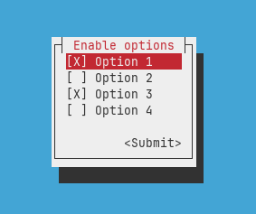

# Cursive Mutliple Choice View

This is a multiple choice view inspired by menuconfig with customizable indicators. The view is largely based on cursive's [`SelectView`](https://github.com/gyscos/cursive/blob/616d8d6f886418c9f06762a0acc4c3ad05864f6d/cursive-core/src/views/select_view.rs).



## Usage
For examples of how to use this view see `examples` folder.

Indicators can be customized with `set_choice_indicators()` (or `with_choice_indicators()`).
```rs
let multiple_choice_view = MultipleChoiceView::new()
	.with_choice_indicators(["☐", "☒"]
	...
);
```